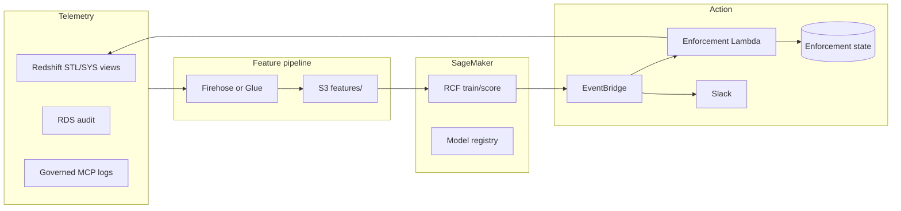

# ML-Based Database Query Monitoring (Part 1 Deep Dive)

> Companion to [`REQUIREMENTS.md`](REQUIREMENTS.md) §5 and [`RESEARCH.md`](RESEARCH.md).
> Focus: **how machine learning fits** the Sentinel / abuse-detection module—not generic MCP security.

---

## 1. Why ML (not only rules) for this problem

**Rule-based monitoring** (e.g. “> 100 queries/hour”) fails for agentic MCP usage because:

| Challenge | Why rules break |
|-----------|-----------------|
| **Heterogeneous users** | A principal running 200 light queries may be normal; another running 20 full-table scans is not. |
| **Bursty agents** | LLM tool loops create **short spikes** that look like attacks but may be one debugging session. |
| **Evolving baselines** | New MCP clients change patterns weekly; static thresholds need constant DBA tuning. |
| **Shadow vs governed** | Same human, different paths—rules on IP alone miss credential sharing. |
| **Near-miss SQL** | Volume is normal; **scan bytes** or **table fan-out** is abnormal. |

**ML role:** learn **per-principal (and per-role) baselines** on multidimensional behavior, score **how unusual this window is**, and attach **explainable features** for Slack + admin review.

ML does **not** replace policy—it **prioritizes** who gets flagged and reduces alert fatigue.

---

## 2. What you are detecting (threat model)

Label in requirements: **programmatic querying abuse**—authorized identity, **abnormal intensity or shape** of access.

### 2.1 Primary anomaly classes

| Class | Signal | Typical MCP/agent cause |
|-------|--------|-------------------------|
| **Volume spike** | Queries/min, concurrent sessions | Tool retry loops, “scan entire warehouse” prompts |
| **Cost spike** | Bytes scanned, CPU seconds, queue time | Missing filters, SELECT * |
| **Fan-out** | Distinct tables per hour | Agent exploring schema via MCP |
| **Off-hours burst** | Activity vs user’s historical hour-of-week | Overnight agent jobs |
| **Repetition** | Low query-text entropy, same hash repeated | Cached bad SQL in a loop |
| **Client shift** | New `application_name` / JDBC tag | New MCP server binary |
| **Governed bypass** | High volume with **no** `client_id=governed-mcp` | Shadow MCP with personal creds |

### 2.2 What ML is bad at alone

- **Semantic wrongness** (“missing WHERE on region”) → use **catalog + param validation** (Part 2), optional verifier.
- **Malicious MCP exfiltration** → MCP security scanners ([MCPSecBench](https://arxiv.org/abs/2508.13220)); different product lane.
- **One-off legitimate crunch** → human override + decay in state machine.

---

## 3. Feature engineering (the real product work)

Aggregate audit logs into **fixed-length feature vectors** per `(principal_id, time_window)`.

### 3.1 Recommended windows

- **Scoring window:** 5 or 15 minutes (near-real-time flag).
- **Baseline window:** rolling 30–90 days (per principal).
- **Comparison:** current window vs same hour-of-week historical median (seasonality).

### 3.2 Feature groups

**Volume & cost**

- `query_count`, `failed_query_rate`
- `sum_elapsed_ms`, `p95_elapsed_ms`
- `sum_bytes_scanned`, `sum_rows_returned`
- `max_bytes_scanned_single_query`

**Shape & exploration**

- `distinct_tables`, `distinct_schemas`
- `ddl_dml_count` (should be ~0 for MCP read paths)
- `query_hash_entropy` / `top_hash_share` (one query dominating)

**Temporal**

- `hour_of_day`, `is_weekend`
- `z_score_vs_hour_of_week` for query_count and bytes_scanned

**Identity & path**

- `is_governed_client` (binary from log tag)
- `distinct_source_ips` (if stable)
- `new_table_access_count` (tables never seen in baseline)

**Optional text-lite features** (no need to embed full SQL in v1)

- `has_limit_clause_rate`, `has_where_clause_rate` (regex on normalized SQL)
- `avg_join_count` (parser optional)

### 3.3 Labels (for tuning, not always for training)

- **Unsupervised in production** (no labels required to run).
- **Weak labels** for evaluation: admin tickets, confirmed abuse, known batch jobs.
- **Synthetic injection:** replay historical logs with multiplied volume to test precision/recall.

---

## 4. ML approaches (what to use on SageMaker)

### 4.1 Recommended default: Random Cut Forest (RCF)

**Why:** Built into [SageMaker RCF](https://docs.aws.amazon.com/sagemaker/latest/dg/randomcutforest.html); unsupervised; handles correlated numeric features; outputs **anomaly score per vector**; fits batch scoring every 5–15 min.

**Pipeline:**

```text
Audit logs (Redshift/RDS) → ETL (Glue/Lambda) → feature parquet on S3
    → SageMaker Batch Transform (RCF) OR persistent Endpoint
    → scores → EventBridge → enforcement + Slack
```

**Ops:** Publish custom metric `AnomalyScore` to CloudWatch; track **anomalies/hour** and **score distribution drift**.

### 4.2 Alternatives (when to escalate)

| Method | When | SageMaker fit |
|--------|------|----------------|
| **Isolation Forest** | Sklearn-familiar team; similar to RCF | Custom script + Processing job |
| **Autoencoders** | Very high-dimensional sparse features | Training job + endpoint |
| **Lookout for Metrics** | Business KPIs without ML team | Managed; less control over DB-native features |
| **CloudWatch Anomaly Detection** | Simple single-metric spikes | Not enough for multi-feature principal behavior |
| **Sequence models (LSTM/Transformer)** | Need session-level “tool loop” patterns | Custom; higher build cost |
| **AnoLLM / tabular LLM AD** | Research / mixed-type logs ([AnoLLM ICLR 2025](https://github.com/amazon-science/AnoLLM-large-language-models-for-tabular-anomaly-detection)) | Experimental; cost/latency for 5-min batch |

### 4.3 Research anchor: contextual access at scale

[Facade — Google (2024)](https://arxiv.org/pdf/2412.06700) is the closest **production-grade** reference:

- Deployed since 2018 for **insider threat** as last line of defense.
- Ingests **SQL query logs** among other access types; featurizes **user–resource** compatibility (often **table-level**, not full SQL text).
- **Unsupervised**, context-aware, near-real-time over heterogeneous logs.

**Takeaway for your service:** You are building a **Facade-class problem** for the **MCP + warehouse** era—not a novel ML problem class, but a **new data source and enforcement hook** (Slack → throttle → suspend).

### 4.4 DBA-oriented ML (adjacent)

[D-Bot — LLM as DBA (2023)](https://arxiv.org/abs/2312.01454) uses LLMs for **diagnosis after** anomalies fire—not the same as scoring, but useful for **v2 “why am I flagged?”** explanations in Slack.

---

## 5. Reference architecture (AWS)



### 5.1 Data sources (by engine)

| Engine | Typical fields |
|--------|----------------|
| **Redshift** | `STL_QUERY`, `SYS_QUERY_HISTORY` — user, starttime, bytes scanned, rows, query text |
| **RDS Postgres** | `pg_stat_statements`, audit extension, pgaudit |
| **Governed path** | API Gateway + Lambda logs — `client_id`, `query_id`, row_count (ground truth for “good” traffic) |

**Critical:** Map `db_user` → **enterprise identity** (SSO) in ETL; Slack and throttle must target humans.

### 5.2 Scoring modes

| Mode | Latency | Cost | Use |
|------|---------|------|-----|
| **Batch Transform** every 15 min | ~15 min | Low | v1 default |
| **Real-time endpoint** | seconds | Higher | Strict SLAs |
| **Embedded in stream** (Kinesis + Lambda + RCF EP) | sub-minute | Medium | High-volume warehouses |

### 5.3 Explainability (required for adoption)

Each alert payload should include:

- `anomaly_score`
- **Top 3 feature contributions** (e.g. bytes_scanned +340% vs baseline, distinct_tables +12)
- **Time window** and **principal**
- **Sample query hashes** (not full SQL in Slack if sensitive)
- Link to **governed MCP** docs

DBAs accept ML alerts when they can **act** without trusting a black box.

---

## 6. Connecting ML scores to enforcement

From [`REQUIREMENTS.md`](REQUIREMENTS.md) state machine—**scores drive transitions**, humans tune thresholds.

| Score / rule | State transition |
|--------------|------------------|
| score ≥ T1 (e.g. 3σ) | `normal` → `flagged` (Slack only) |
| score ≥ T2 in 2+ windows in 1h while flagged | `flagged` → `throttled` |
| score ≥ T3 or manual confirm | `throttled` → `suspended` |
| score < T0 for 24h | decay toward `normal` |

**Hybrid policy (recommended):**

```text
alert = (ml_score > threshold) OR (hard_rule: queries_per_min > absolute_cap)
```

Hard caps catch **obvious disasters**; ML catches **sophisticated sustained abuse**.

**Feedback loop:** Admin marks false positive → down-weight features or add to allowlist (batch job exclusion, known ETL principal).

---

## 7. Differentiation vs. native DB tools

| Capability | Native DB monitoring | Your ML Sentinel |
|------------|----------------------|------------------|
| Slow queries | Yes | Yes (as features) |
| Per-user **behavioral** baseline | Limited | Core |
| **Agent/MCP** client tagging | Rare | Core (governed vs shadow) |
| **Progressive enforcement** + Slack | No | Core |
| Tie-in to **governed MCP** | No | Core (Part 2) |

Sell: **“Behavioral firewall for agentic warehouse access”**—not replacement for Redshift Advisor, **overlay** for AI-era abuse.

---

## 8. Service offering: ML module packaging

| Tier | Deliverable |
|------|-------------|
| **Assess** | 30-day log profile; baseline variance report; false-positive risk estimate |
| **Build** | Feature store schema, RCF pipeline, dashboards, enforcement hooks |
| **Operate** | Retrain quarterly; threshold tuning; incident retros |

**Proof points for sales:**

- Precision/recall on **injected abuse** scenarios in customer’s historical shape.
- Time-to-detect vs static rules (target: catch sustained loops in &lt; 15 min with batch scoring).
- **FinOps:** attribute scan-dollar anomaly to principal (bytes_scanned × list price).

---

## 9. Open technical decisions

1. **Principal grain:** `db_user` only vs SSO-mapped id (required for Slack).
2. **Cold start:** new hire / new MCP → use **role-level** baseline until 14 days of history.
3. **Seasonality:** fiscal close weeks → hour-of-week features or “known event” calendar.
4. **Multi-warehouse:** one model per engine or unified feature schema.
5. **Label program:** will customer security team tag incidents for semi-supervised retrain?

---

## 10. Suggested updates to REQUIREMENTS.md §5.3

Expand SageMaker section with:

- Default algorithm: **RCF** + batch scoring interval
- Feature list (§3.2 above)
- Explainability payload (§5.3)
- Hybrid ML + hard-cap rules (§6)
- Facade/Google as design precedent for SQL log contextual AD
- FinOps features (`estimated_scan_cost_usd`)

---

## References

- [Facade — insider threat on SQL/access logs (Google, 2024)](https://arxiv.org/pdf/2412.06700)
- [Amazon SageMaker Random Cut Forest](https://docs.aws.amazon.com/sagemaker/latest/dg/randomcutforest.html)
- [AnoLLM — tabular/log anomaly via LLM (Amazon Science, ICLR 2025)](https://github.com/amazon-science/AnoLLM-large-language-models-for-tabular-anomaly-detection)
- [D-Bot — LLM-assisted DB anomaly diagnosis](https://arxiv.org/abs/2312.01454)
- [Securing MCP — Errico et al. (2025) — inline anomaly detection control](https://arxiv.org/abs/2511.20920)
- [Data-centric AI Survey — Zha et al. (2023)](https://arxiv.org/abs/2303.10158) — feature/label engineering emphasis
