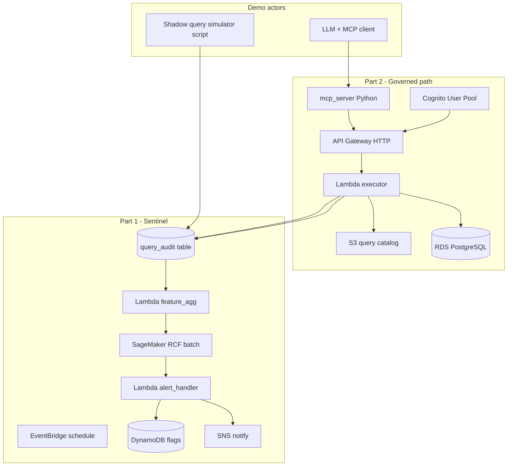

# MVP Spec — MCP Query Governance (Portfolio)

> **Purpose:** Build a **demonstrable** AWS case study, not production hardening.
> Implements your original two-part design in simplified form. Evolves to
> production via [`REQUIREMENTS.md`](REQUIREMENTS.md) + [`BLIND_SPOTS.md`](BLIND_SPOTS.md).

**Status:** Ready to implement  
**Target:** ~2–3 weeks focused build, readable README, 5-minute demo video path

---

## 1. MVP goals

| In scope | Out of scope (MVP) |
|----------|-------------------|
| Show **governed query path** (catalog → API → Lambda → DB + RLS) | AgentCore Gateway, Lake Formation |
| Show **query monitoring** with **SageMaker RCF** on aggregated features | Auto-throttle, credential suspend |
| **Slack-style alert** via SNS (email or webhook URL) | HR/legal workflow, shared-account mapping |
| **Synthetic + demo DB** (no real customer data) | Redshift production integration |
| Full **audit log** in CloudWatch + S3 | 90-day warehouse log archive |
| Portfolio README + architecture diagram | Multi-tenant SaaS billing |

### Easy wins folded in (low effort)

- **Notify-only enforcement** (`flagged` state)—no throttle/suspend ([`BLIND_SPOTS.md`](BLIND_SPOTS.md))
- **`client_id`** on every governed call (`governed-mcp`) for shadow vs official comparison
- Response includes **`executed_sql`** + row count + `query_id` version
- **Correlation ID** on every request (API → logs)
- **Hard cap** rule alongside ML: e.g. `queries_15m > 50` → flag (hybrid alert)
- Catalog in **S3 + version field**; Git-friendly JSON files

---

## 2. Architecture (MVP)



**Demo data plane:** **Amazon RDS PostgreSQL** (db.t4g.micro or small Serverless v2)—cheaper and simpler than Redshift for a portfolio repo. Production evolution swaps `query_audit` ingestion for Redshift `SYS_QUERY_HISTORY` export (same feature schema).

---

## 3. AWS services (minimal set)

| Service | Role |
|---------|------|
| **Amazon RDS PostgreSQL** | Demo warehouse + `query_audit` table |
| **Amazon S3** | Query catalog JSON, RCF training/scoring CSV, optional audit export |
| **AWS Lambda** | Query executor, feature aggregation, alert handler, optional MCP-adjacent helpers |
| **Amazon API Gateway (HTTP)** | `POST /v1/queries/execute` + Cognito JWT authorizer |
| **Amazon Cognito** | User pool; JWT carries `sub` + custom `tenant_id` claim |
| **Amazon EventBridge** | Rate(15 minutes) trigger feature + score pipeline |
| **Amazon SageMaker** | Random Cut Forest — **batch transform** on S3 CSV (no real-time endpoint) |
| **Amazon DynamoDB** | `principal_id` → `state` (`normal` \| `flagged`), `last_score`, `updated_at` |
| **Amazon SNS** | Alert topic (email or HTTPS webhook for Slack) |
| **AWS CloudWatch Logs** | Lambda logs; structured JSON per query |
| **AWS CDK (Python)** | Single stack deploys above |

**Not in MVP:** Step Functions, Kinesis, OpenSearch, Secrets Manager rotation automation, WAF, PrivateLink.

---

## 4. Data model

### 4.1 `query_audit` (RDS)

Every query (governed + simulated shadow) inserts one row:

| Column | Type | Notes |
|--------|------|-------|
| `id` | uuid | PK |
| `ts` | timestamptz | |
| `principal_id` | text | Cognito `sub` or simulator user id |
| `client_id` | text | `governed-mcp` \| `shadow-simulator` |
| `query_id` | text | null for shadow |
| `sql_hash` | text | md5 normalized sql |
| `bytes_scanned` | bigint | simulator sets; governed uses `pg_relation_size` proxy or row_count × constant |
| `row_count` | int | |
| `duration_ms` | int | |
| `status` | text | `success` \| `failed` |

### 4.2 S3 catalog entry (`catalog/{query_id}.json`)

```json
{
  "query_id": "pipeline_summary",
  "version": "1.0.0",
  "description": "Monthly pipeline ARR by region for LLM tool selection.",
  "parameters": {
    "fiscal_year": { "type": "integer", "required": true },
    "region_code": { "type": "string", "required": false, "enum": ["NA", "EMEA", "APAC"] }
  },
  "sql_template": "SELECT region_code, SUM(arr) AS arr FROM pipeline WHERE fiscal_year = :fiscal_year {{RLS}} GROUP BY 1",
  "rls_column": "tenant_id",
  "max_rows": 500
}
```

Lambda replaces `{{RLS}}` with `AND tenant_id = '<from JWT>'` (parameterized).

### 4.3 DynamoDB `enforcement_state`

- PK: `principal_id`
- Attributes: `state`, `last_anomaly_score`, `flagged_at`, `reason_features` (JSON string)

---

## 5. Part 2 — Governed MCP (MVP behavior)

### 5.1 API

`POST /v1/queries/execute`

```json
{
  "query_id": "pipeline_summary",
  "parameters": { "fiscal_year": 2025, "region_code": "NA" },
  "correlation_id": "optional-uuid"
}
```

Response:

```json
{
  "correlation_id": "…",
  "query_id": "pipeline_summary",
  "version": "1.0.0",
  "executed_sql": "SELECT … AND tenant_id = 'tenant-a' …",
  "row_count": 12,
  "data": [ { "region_code": "NA", "arr": 1000 } ],
  "truncated": false
}
```

Errors: `MISSING_PARAM`, `INVALID_PARAM`, `CATALOG_NOT_FOUND`, `UNAUTHORIZED`.

### 5.2 MCP server (Python)

Minimal [MCP](https://modelcontextprotocol.io) server (stdio) with tools:

| Tool | Behavior |
|------|----------|
| `list_queries` | Reads S3 catalog index `catalog/index.json` |
| `run_query` | Gets Cognito token (env/client secret or device flow doc for demo), calls API Gateway |

Runs locally in Cursor/Claude Desktop config—**portfolio demo friendly**.

### 5.3 RLS (MVP)

- Seed table `pipeline(tenant_id, region_code, fiscal_year, arr)`.
- JWT includes custom attribute `custom:tenant_id`.
- No Lake Formation; single-column tenant filter only.

### 5.4 Limits (avoid Lambda/Data API pain)

- `max_rows` enforced in SQL: `LIMIT 500`
- Queries must finish in **&lt; 30s** (RDS + small data)
- No async Step Functions in MVP

---

## 6. Part 1 — Sentinel (MVP behavior)

### 6.1 Pipeline (every 15 minutes)

1. **Lambda `feature_agg`:** SQL aggregate last 15m per `principal_id`:
   - `query_count`, `sum_bytes_scanned`, `distinct_sql_hash`, `shadow_ratio` (share from `client_id != governed-mcp`)
2. Write `s3://{bucket}/features/latest.csv`
3. **SageMaker RCF Batch Transform** (or Processing job with sklearn IsolationForest if RCF setup is heavy—**prefer RCF** for AWS story):
   - Train on `s3://{bucket}/features/training/` (7 days synthetic baseline from generator)
   - Score `latest.csv` → `scores.csv`
4. **Lambda `alert_handler`:**
   - If `score > threshold` OR `query_count > 50` → set DynamoDB `flagged`, publish SNS
   - SNS message: principal, score, top features, link to README “use governed MCP”

### 6.2 Synthetic abuse for demo

Script `scripts/simulate_shadow_abuse.py`:

- 10 normal principals: steady low volume
- 1 abuser: 200 queries / 15m, high `bytes_scanned`
- RCF + hard rule both flag abuser on demo run

### 6.3 Enforcement (MVP)

**Only `normal` and `flagged`.** No throttle/suspend. Optional: governed API checks DynamoDB and returns `403` with message if `flagged` (easy, shows closed loop).

---

## 7. Repository layout

```text
mcp-query-governance/
├── MVP_SPEC.md              # this file
├── README.md                # quickstart, demo steps, disclaimer
├── infra/
│   └── cdk/
│       ├── app.py
│       └── stack.py         # single stack
├── catalog/
│   ├── index.json
│   └── pipeline_summary.json
├── src/
│   ├── executor/            # Lambda: validate, RLS, run SQL, audit insert
│   ├── sentinel/            # feature_agg, alert_handler
│   └── mcp_server/          # list_queries, run_query
├── scripts/
│   ├── seed_database.py
│   ├── generate_baseline_features.py
│   └── simulate_shadow_abuse.py
├── sagemaker/
│   └── rcf_train_score.py   # optional notebook
└── docs/
    └── demo-walkthrough.md
```

---

## 8. CDK stack outline (one stack)

| Construct | Notes |
|-----------|-------|
| `Vpc` | Optional: default VPC + RDS public subnet **or** no VPC + RDS publicly accessible **demo only**—document security warning |
| `DatabaseInstance` or `ServerlessCluster` | Postgres 15, init SQL for schema |
| `Bucket` | catalog + ml features |
| `UserPool` + app client | test user `demo@local` / password in Secrets Manager |
| `HttpApi` + routes | `/v1/queries/execute` |
| `Function` executor | IAM: S3 read catalog, RDS connect, logs |
| `Function` feature_agg, alert_handler | |
| `Table` enforcement | DynamoDB on-demand |
| `Topic` alerts | SNS |
| `Rule` schedule | rate(15 minutes) → feature_agg |
| `Role` SageMaker | S3 read/write for RCF job (or run RCF from Lambda with sklearn fallback documented) |

**Cost control:** `cdk destroy` friendly; no NAT gateway in MVP.

---

## 9. Implementation order

| Step | Deliverable | Est. |
|------|-------------|------|
| 1 | CDK + RDS schema + seed data | 2–3 days |
| 2 | S3 catalog + executor Lambda + API + Cognito | 2–3 days |
| 3 | MCP server calling API (local demo) | 1 day |
| 4 | `query_audit` writes + shadow simulator | 1 day |
| 5 | Feature agg + RCF train/score + SNS alert | 2–3 days |
| 6 | README demo script + optional `flagged` block on API | 1 day |

**Total:** ~10–12 days part-time.

---

## 10. Demo script (portfolio)

1. Show CloudWatch log: governed `run_query` with `executed_sql` + RLS.
2. Run `simulate_shadow_abuse.py` → wait 15m or trigger Lambdas manually.
3. Show DynamoDB `flagged` + SNS notification.
4. Show SageMaker batch output CSV with anomaly score.
5. Explain production path: Redshift `SYS_QUERY_HISTORY` → same features, AgentCore Gateway optional.

---

## 11. Production evolution (document only)

| MVP | Production |
|-----|------------|
| RDS + `query_audit` | Redshift `SYS_QUERY_HISTORY` → S3 via scheduled export |
| SNS alert | Slack app + paging |
| `flagged` only | throttle (API GW usage plan) → suspend (IAM/Secrets) |
| 3–5 catalog queries | GitOps catalog pipeline + approvers |
| Cognito test pool | IAM Identity Center + OBO |
| Single RCF model | Retrain schedule + allowlisted ETL principals |

Consider **Bedrock AgentCore Gateway** as front door later—keep executor Lambda as target.

---

## 12. Success criteria (MVP done)

- [ ] `cdk deploy` brings up API + RDS + Cognito
- [ ] MCP `run_query` returns data + `executed_sql` for catalog query
- [ ] Shadow simulator fills `query_audit`; Sentinel flags abuser principal
- [ ] SNS (or logged “would notify”) fires with score + features
- [ ] README lets reviewer run demo in &lt; 30 minutes
- [ ] Clear **“synthetic demo, not production”** disclaimer

---

## 13. Environment variables / secrets

| Name | Used by |
|------|---------|
| `DATABASE_URL` | Lambdas (Secrets Manager in CDK) |
| `CATALOG_BUCKET` | executor |
| `FEATURE_BUCKET` | sentinel |
| `SNS_TOPIC_ARN` | alert_handler |
| `ANOMALY_THRESHOLD` | alert_handler (default 3.0 RCF score) |
| `COGNITO_*` | mcp_server local demo |

---

## 14. Testing (lightweight)

- Unit: parameter validation, RLS SQL build (no DB)
- Integration: executor against RDS in CI optional (skip in GitHub Actions without AWS)
- Manual: demo script end-to-end after deploy

No requirement for MCPSecBench or full security audit in MVP.

---

*MVP spec v1.0 — portfolio showcase, AWS-native, intentionally small.*
