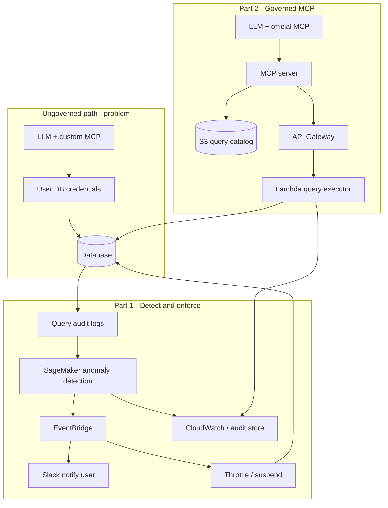
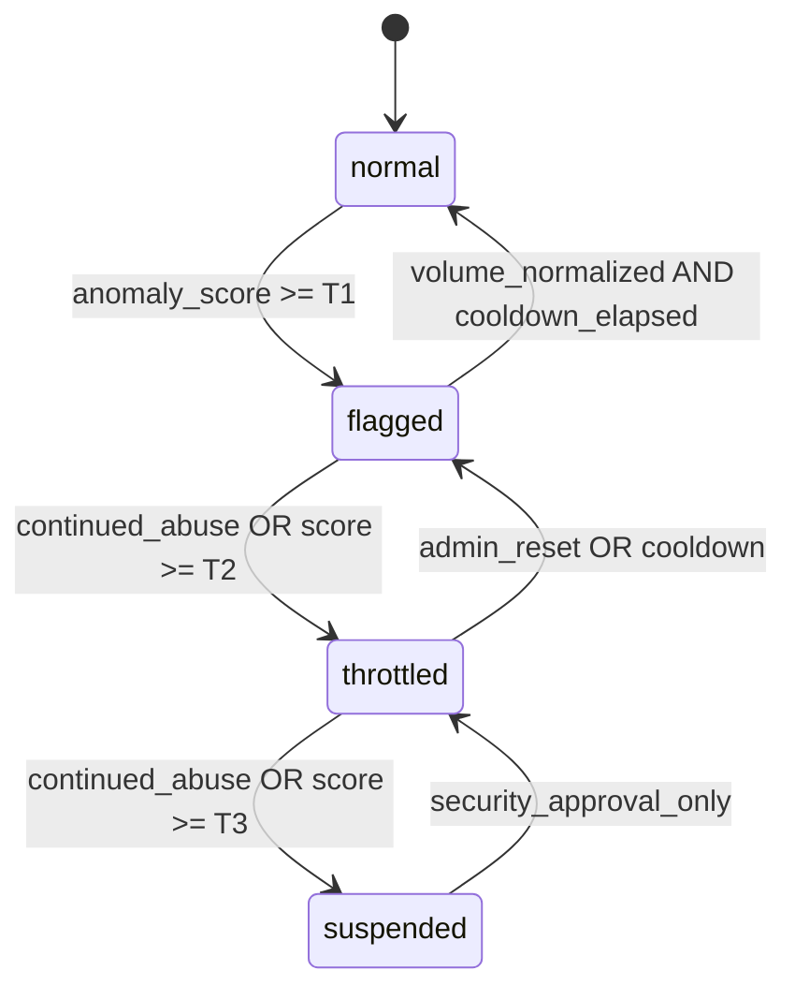

# MCP Query Governance Platform — Requirements Guide

> **Status:** Draft for review. Solution not fully built; use this document to
> align stakeholders, scope phases, and lock architecture decisions before
> implementation.

---

## 1. Problem statement

### 1.1 What changed

With AI coding tools, builders increasingly connect **custom MCP servers** to
LLMs using **personal or team database credentials**. The LLM generates SQL;
the MCP executes it against production or near-production warehouses.

### 1.2 Pain for data management

| Pain | Why it matters |
|------|----------------|
| **Query volume spike** | Programmatic loops (agent retries, tool chains, exploratory chat) generate far more heavy scans than interactive BI usage. |
| **No throttling** | Ungoverned MCP paths bypass existing BI quotas, WAF rules, and human-paced usage patterns. |
| **Unknown correctness** | A query can *return rows* but still be wrong—missing filters, wrong date grain, omitted RLS predicates, or hallucinated column names. |
| **Credential sprawl** | Users hold DB passwords or IAM-derived credentials locally in MCP config; revocation and audit are opaque. |
| **Shadow infrastructure** | Data platform team cannot see which MCPs exist, what they query, or who is responsible. |

### 1.3 Desired end state

1. **Detect** anomalous programmatic query behavior, **notify** the user, and **escalate** through throttle → suspend if abuse continues.
2. **Offer** an official MCP where queries run only through a **controlled execution plane** (auth, RLS, cataloged patterns, full audit).

---

## 2. Goals, non-goals, and success metrics

### 2.1 Goals

- Reduce ungoverned warehouse load from MCP-driven query storms.
- Give data platform **visibility** (who, what, how often, from which client).
- Give users a **supported path** that is safer and more accurate than DIY MCP + raw creds.
- Enforce **progressive response** to abuse without immediate hard lockout on first offense.
- Prove **what SQL ran** and **what data returned** for every governed call.

### 2.2 Non-goals (v1 unless explicitly added)

- Replacing the corporate LLM or IDE—only governing **data access paths**.
- Letting the LLM write arbitrary ad-hoc SQL against raw credentials in the governed MCP (catalog-driven or parameterized templates only in v1).
- Real-time ML explanation of *semantic* SQL correctness (v1 focuses on **parameter/schema validation** + optional row-count bounds; full “answer correctness” may be a later verifier agent).
- Blocking all third-party MCPs network-wide without an enterprise policy mandate (detection can run in parallel with voluntary migration to the governed MCP).

### 2.3 Success metrics (define targets with stakeholders)

| Metric | Example target |
|--------|----------------|
| % warehouse queries via governed MCP | Increase month over month |
| Median time-to-throttle for confirmed abuse | < 15 minutes from detection |
| False-positive rate on anomaly flags | < 5% of flagged users (tune model) |
| Credential suspensions per month | Decreasing trend after governed MCP launch |
| Governed query parameter validation failure rate | Tracked; used to improve catalog |
| P95 governed query latency | e.g. < 10s for catalog queries |

---

## 3. Stakeholders and personas

| Persona | Needs |
|---------|--------|
| **Data platform / DBA** | Telemetry, throttling, kill switch, catalog governance |
| **Security / IAM** | No long-lived creds in MCP configs; suspension hooks |
| **MCP builder (analyst, SA, engineer)** | Same “ask data in chat” UX, faster approval than ticket queue |
| **LLM client (Cursor, Claude Desktop, internal agent)** | Stable MCP tools, predictable errors |
| **Compliance / audit** | Immutable logs: user, SQL, row count, timestamp, client id |

---

## 4. Solution overview (two parts)



**Part 1** observes the database (or proxy) and acts on principals.  
**Part 2** redirects demand to a safe path. Both should share **identity**, **logging schema**, and **enforcement state** where possible.

---

## 5. Part 1 — Anomaly detection and progressive enforcement

### 5.1 Functional requirements

| ID | Requirement | Priority |
|----|-------------|----------|
| P1-FR-01 | Ingest per-principal query telemetry: timestamp, duration, rows scanned/returned, database user, source IP/client tag if available, query hash or normalized text. | Must |
| P1-FR-02 | Compute baseline behavior per principal (and optionally per role/team): queries per hour, total scan bytes, concurrent sessions, off-hours share. | Must |
| P1-FR-03 | Run SageMaker (or SageMaker-hosted) anomaly detection on feature vectors at a defined interval (e.g. 5–15 min) and on sliding windows. | Must |
| P1-FR-04 | Emit structured detection events with severity, principal id, anomaly score, and top contributing features. | Must |
| P1-FR-05 | Log all detections and enforcement actions to CloudWatch Logs and a durable audit store (S3 + Glacier or OpenSearch). | Must |
| P1-FR-06 | Route high-severity events through EventBridge for automation. | Must |
| P1-FR-07 | Send Slack DM (or channel + mention) to the flagged user with: what was detected, time window, link to policy, and how to use the governed MCP. | Must |
| P1-FR-08 | Maintain an enforcement **state machine** per principal: `normal` → `flagged` → `throttled` → `suspended`. | Must |
| P1-FR-09 | On `throttled`: apply rate limits (queries/min, max concurrency, or WAF/proxy rules)—mechanism depends on DB integration (see §12). | Must |
| P1-FR-10 | On `suspended`: disable DB login and/or revoke IAM/Secrets Manager access used by MCP; block at connection pool or IdP group. | Must |
| P1-FR-11 | Require human or timed auto-decay for downgrade (e.g. flagged → normal after 24h if volume normalizes). | Should |
| P1-FR-12 | Admin override API or runbook to clear false positives. | Must |
| P1-FR-13 | Correlate governed MCP `client_id` vs unknown clients in telemetry to prioritize shadow MCP traffic. | Should |

### 5.2 Enforcement state machine



**Policy parameters to define:**

- Thresholds T1, T2, T3 (scores or rules).
- **Continued abuse:** e.g. ≥ N anomalies in M hours while in `flagged`.
- **Cooldown** durations per state.
- Whether first offense is notify-only (recommended: `flagged` = Slack only, no throttle).

### 5.3 SageMaker scope (requirements, not algorithm lock-in)

| Topic | Requirement |
|-------|-------------|
| **Input features** | At minimum: query count, bytes scanned, failed query rate, distinct tables, hour-of-day entropy, client tag (if present). |
| **Granularity** | Per `db_user` or per `enterprise_user_id` mapped from SSO. |
| **Training** | Initial baseline from 30–90 days historical audit logs; retrain on schedule. |
| **Inference** | Batch scoring job (SageMaker Processing) or real-time endpoint if latency requires < 5 min detection. |
| **Explainability** | Store top feature contributions in the event payload for Slack and audits. |
| **Human review** | Queue borderline scores (e.g. 0.4–0.6) for optional manual review before throttle. |

### 5.4 AWS logging and integration (Part 1)

| Event type | Destination |
|------------|-------------|
| Raw query audit | S3 data lake + optional Kinesis Firehose |
| Anomaly scores | CloudWatch metric + S3 |
| Enforcement transition | EventBridge → Lambda → IAM/DB admin API |
| User notification | Slack via AWS Chatbot or Lambda + Slack webhook |
| Security incidents | Optional Security Hub custom finding |

---

## 6. Part 2 — Governed MCP and query execution plane

### 6.1 Functional requirements

| ID | Requirement | Priority |
|----|-------------|----------|
| P2-FR-01 | Publish an **official MCP server** exposing tools such as `list_queries`, `run_query`, `describe_query` (names TBD). | Must |
| P2-FR-02 | Store **query definitions** in S3: stable `query_id`, description for LLM, SQL template with placeholders, required/optional parameters, allowed tables, max rows, timeout, RLS strategy. | Must |
| P2-FR-03 | MCP resolves `query_id` + parameters from LLM; does **not** accept raw SQL from the client in v1. | Must |
| P2-FR-04 | MCP calls API Gateway with OAuth bearer token (user or machine token per client type). | Must |
| P2-FR-05 | Lambda validates JWT, maps to enterprise identity, loads query definition from S3 (versioned), validates parameters (types, ranges, enums). | Must |
| P2-FR-06 | Lambda injects **RLS** server-side (permissions join or equivalent)—never trust LLM to add WHERE clauses. | Must |
| P2-FR-07 | Lambda executes via controlled DB API (e.g. Redshift Data API, RDS Data API)—no end-user password in MCP config. | Must |
| P2-FR-08 | Response includes **result data** + **executed SQL** (post-RLS) + **metadata** (row count, runtime, data freshness, query_id version). | Must |
| P2-FR-09 | Reject execution if required parameters missing or if validation fails (clear error for LLM to retry). | Must |
| P2-FR-10 | Log every request: correlation_id, user, query_id, params (redacted), row count, bytes, latency, outcome. | Must |
| P2-FR-11 | Catalog changes require version bump; Lambda pins to `latest` or explicit version per environment. | Should |
| P2-FR-12 | Rate limits per user at API Gateway usage plan aligned with Part 1 enforcement state. | Must |

### 6.2 S3 query catalog — logical schema (requirements)

Each query document (JSON or YAML) should support:

```yaml
query_id: pipeline_summary_v2
version: "2.1.0"
description: "LLM-facing summary of what this query answers"
parameters:
  - name: fiscal_year
    type: integer
    required: true
  - name: region_code
    type: string
    required: false
    enum: [NA, EMEA, APAC]
sql_template: |
  SELECT ... FROM approved_table t
  WHERE t.fiscal_year = :fiscal_year
  {{RLS_FILTER}}
rls_mode: permissions_join   # or territory_subquery, global_skip
allowed_tables: [approved_table]
limits:
  max_rows: 5000
  timeout_seconds: 30
freshness:
  max_data_age_days: 7
```

**Governance workflow:** draft in git → PR review by data platform → publish to S3 `catalog/{env}/approved/`.

### 6.3 MCP ↔ API contract (high level)

| Step | Behavior |
|------|----------|
| 1 | LLM chooses `query_id` and parameters from tool description. |
| 2 | MCP validates JSON schema locally (optional fast fail). |
| 3 | `POST /v1/queries/execute` with `{ query_id, version?, parameters, correlation_id }`. |
| 4 | Lambda returns `{ data, executed_sql, metadata, warnings? }` or structured error codes (`MISSING_PARAM`, `RLS_DENIED`, `TIMEOUT`, `CATALOG_NOT_FOUND`). |

### 6.4 Accuracy controls (addressing “missing parameters”)

| Control | Layer | Requirement |
|---------|-------|-------------|
| **Schema validation** | Lambda | Required params enforced before SQL build. |
| **Template-only SQL** | Catalog | No free-text SQL from LLM in v1. |
| **Row/count bounds** | Lambda | Abort or warn if row count exceeds `max_rows`. |
| **Optional verifier** | Post-execution (v2) | Re-run aggregates or compare to golden metric; block if drift > threshold. |
| **Transparency** | Response | Return executed SQL so user can spot bad filters in the UI. |

---

## 7. Cross-cutting requirements

### 7.1 Identity and authentication

| ID | Requirement |
|----|-------------|
| X-FR-01 | Single enterprise identity (SSO sub or employee id) across Part 1 telemetry mapping and Part 2 JWT. |
| X-FR-02 | MCP OAuth: Cognito or IAM Identity Center; scopes e.g. `queries:execute`, `queries:read_catalog`. |
| X-FR-03 | No database passwords in MCP configuration files; short-lived tokens only. |
| X-FR-04 | Service accounts for automation clearly tagged in telemetry (`client_id`). |

### 7.2 Security

| ID | Requirement |
|----|-------------|
| X-SEC-01 | Least-privilege IAM per Lambda, SageMaker, and MCP host roles. |
| X-SEC-02 | Secrets in Secrets Manager; rotation policy defined. |
| X-SEC-03 | S3 catalog bucket: encryption, versioning, block public access, approval workflow. |
| X-SEC-04 | API Gateway: WAF, throttling, JWT authorizer, optional mTLS for internal clients. |
| X-SEC-05 | SELECT-only execution role; deny DDL/DML at connection level. |
| X-SEC-06 | PII columns masked or excluded per query definition metadata. |

### 7.3 Observability

| ID | Requirement |
|----|-------------|
| X-OBS-01 | Correlation id from MCP through Lambda to DB audit row. |
| X-OBS-02 | Dashboards: query volume by path (governed vs other), anomaly rate, enforcement counts. |
| X-OBS-03 | Alerts on Lambda error rate, catalog load failures, SageMaker pipeline failures. |

### 7.4 Non-functional requirements

| Category | Target (adjust per environment) |
|----------|----------------------------------|
| Availability (governed path) | 99.5% business hours |
| Detection latency | < 15 min from behavior to Slack for batch scoring |
| Governed query P95 latency | < 10s for catalog queries under row caps |
| Audit retention | ≥ 1 year online, longer in Glacier per policy |
| RTO for catalog rollback | < 1 hour via S3 version revert |

---

## 8. Data sources and dependencies

| Source | Used by | Notes |
|--------|---------|-------|
| Database audit logs (Redshift `STL_QUERY`, RDS audit, etc.) | Part 1 | Primary signal; confirm fields and retention. |
| IAM / IdP directory | Part 1, 2 | Map `db_user` → human for Slack. |
| Slack workspace | Part 1 | Bot token, user lookup by email. |
| S3 query catalog | Part 2 | Versioned definitions. |
| Permissions table / view | Part 2 RLS | Same model as existing BI (e.g. territory permissions). |
| Optional: API Gateway access logs | Part 1 | Compare governed vs shadow volume. |

---

## 9. Phased delivery (recommended)

### Phase 0 — Discovery (2–4 weeks)

- Inventory shadow MCP usage signals (VPN, audit tags, surveys).
- Confirm DB audit log fields and whether throttling can be applied at proxy, pool, or account level.
- Draft query catalog MVP (5–10 high-value queries).

### Phase 1 — Governed MCP MVP

- S3 catalog + Lambda executor + API Gateway + Cognito.
- MCP with `run_query` only; manual catalog updates.
- Full request/response logging.

### Phase 2 — Detection + notify

- SageMaker baseline + batch scoring.
- Slack notification on `flagged` (no auto-throttle yet).

### Phase 3 — Automated enforcement

- Throttle and suspend integrations.
- Tie API Gateway usage plans to enforcement state.
- Admin console or CLI for overrides.

### Phase 4 — Hardening

- Catalog CI/CD, drift detection, optional verifier agent.
- Security Hub integration, compliance reporting.

---

## 10. AWS service mapping (reference architecture)

| Capability | AWS service (candidate) |
|------------|-------------------------|
| Query catalog | S3 + optional GitHub Actions deploy |
| MCP hosting | Lambda (MCP protocol) or ECS; or AgentCore Gateway |
| Execution | Lambda + Redshift Data API / RDS Data API |
| API edge | API Gateway HTTP + Cognito authorizer + WAF |
| Anomaly ML | SageMaker Training + Batch Transform or Inference Endpoint |
| Orchestration | EventBridge + Step Functions (enforcement workflow) |
| Logging | CloudWatch Logs, Kinesis Firehose → S3 |
| Notifications | SNS → Lambda → Slack |
| Identity | Cognito or IAM Identity Center |
| Credential suspension | IAM + Secrets Manager + custom DB revoke Lambda |

---

## 11. Risks and mitigations

| Risk | Mitigation |
|------|------------|
| False positives throttle legitimate power users | Notify-first phase; admin override; per-role baselines |
| Cannot throttle at DB layer quickly | Introduce connection pooler or proxy; rate limit at API Gateway for governed path first |
| LLM picks wrong `query_id` | Rich descriptions in catalog; `list_queries` tool; few queries in v1 |
| Catalog staleness | Versioning, ownership per query, automated schema drift checks |
| Users bypass governed MCP entirely | Part 1 detection + policy; network controls where mandated |
| Slack fatigue | Digest mode; severity tiers; only DM on first flag per week |

---

## 12. Open decisions (need your input)

Answer these before implementation planning:

1. **Database platform** — Redshift, RDS Postgres, both? (Drives audit log format and Data API choice.)
2. **Throttle mechanism** — Can you revoke/limit at DB user, connection pool (PgBouncer/RDS Proxy), or only at a new governed API?
3. **Principal key** — Enforce on `db_username`, SSO email, or application `client_id`?
4. **SageMaker mode** — Batch scoring (cheaper, 5–15 min lag) vs real-time endpoint?
5. **MCP hosting** — Standalone Lambda MCP vs AgentCore Gateway (you have prior art on Gateway + Cognito).
6. **Raw SQL in v2?** — Will power users ever need parameterized *fragments* or still template-only forever?
7. **Slack workflow** — DM only vs channel + data-platform visibility?
8. **Legal/policy** — Is credential suspension automatic or requires security ticket after `suspended` state?
9. **Overlap with existing RACE MCP** — Greenfield vs extend existing `race-ai-gateway-mcp` patterns?

---

## 13. Portfolio / case study angle (when you build later)

If this becomes a portfolio repo (like `ai-coding-spillover-analysis`), the demonstrable artifacts could include:

- CDK/Terraform for Part 2 minimal path (catalog + Lambda + API GW).
- Synthetic query audit generator feeding a SageMaker anomaly notebook.
- Enforcement state machine diagram + sample Slack payload.
- Sample catalog entries and example MCP tool definitions.
- **Not** production credentials or real customer SQL.

---

## 14. Requirements checklist (sign-off)

Use this for stakeholder review:

- [ ] Problem statement and non-goals agreed
- [ ] Enforcement states and thresholds defined
- [ ] Telemetry fields available in audit logs confirmed
- [ ] Throttle/suspend mechanism chosen (§12 Q2)
- [ ] Query catalog schema and approval workflow owned
- [ ] Identity model unified across Part 1 and Part 2
- [ ] Slack and admin override process documented
- [ ] Phase 1 scope locked (governed MCP only vs detection in parallel)

---

*Document version: 0.1 — requirements draft for MCP Query Governance Platform.*
